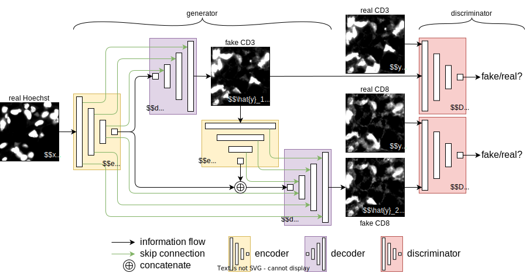

HoechstGAN
==========

This repository contains the code for the paper *HoechstGAN: Virtual Lymphocyte Staining Using Generative Adversarial
Networks*.



## Installing
We provide a `Dockerfile` as well as a `docker-compose.yml` file that builds the Docker container and mounts the code (i.e. this repository) as a volume.
```
docker-compose up -d --build
```
Then, in the `hoechstgan` container, run
```
./install.sh
```

## Code
The structure of the code is inspired by the [pytorch implementation of pix2pix](https://github.com/junyanz/pytorch-CycleGAN-and-pix2pix), but has been heavily modified.
We use [hydra](https://hydra.cc) for configuration management and [wandb](http://wandb.ai) for tracking experiments.

Most of the relevant implementation is concentrated in the following files: [hoechstgan.py](hoechstgan/models/hoechstgan.py), [networks.py](hoechstgan/models/networks.py), and [composites.py](hoechstgan/util/composites.py).

## Training
The table below lists the commands used to train each of the models evaluated in Table 2 of the paper.

| Model                                       | Command                                                                                                                                                                                                                                                                                |
| ------------------------------------------- | -------------------------------------------------------------------------------------------------------------------------------------------------------------------------------------------------------------------------------------------------------------------------------------- |
| HoechstGAN-MCD                              | `poetry run python train.py +experiment=hoechstgan_composite discriminator.type=joint generator.composites.0.train.schedule=sigmoid generator.composites.0.train.args.from_epoch=8 generator.composites.0.train.args.to_epoch=12 dataset.max_size=250000 norm=instance`                |
| HoechstGAN-MC                               | `poetry run python train.py +experiment=hoechstgan_composite generator.composites.0.train.schedule=sigmoid generator.composites.0.train.args.from_epoch=8 generator.composites.0.train.args.to_epoch=12 dataset.max_size=250000`                                                       |
| HoechstGAN-MD                               | `poetry run python train.py +experiment=hoechstgan discriminator.type=joint dataset.max_size=250000`                                                                                                                                                                                   |
| HoechstGAN-M                                | `poetry run python train.py +experiment=hoechstgan dataset.max_size=250000`                                                                                                                                                                                                            |
| HoechstGAN-D                                | `poetry run python train.py +experiment=hoechstgan_basic discriminator.type=joint dataset.max_size=250000`                                                                                                                                                                             |
| [pix2pix](https://arxiv.org/abs/1611.07004) | `poetry run python train.py +experiment=cy3 dataset.max_size=250000` and <br> `poetry run python train.py +experiment=cy5 dataset.max_size=250000`                                                                                                                                     |
| Regression-MCD                              | `poetry run python train.py +experiment=hoechstgan_composite discriminator.type=joint generator.composites.0.train.schedule=sigmoid generator.composites.0.train.args.from_epoch=8 generator.composites.0.train.args.to_epoch=12 dataset.max_size=250000 norm=instance gan=regression` |

Some other useful command-line options are: `gpus`, `dataset.num_threads`, and `dataset.batch_size`. 
All of the options are described in the [config.yaml](conf/config.yaml) file.

## Testing
To test a model, obtain its wandb ID and run
```
poetry run python test.py {wandb_id}
```
